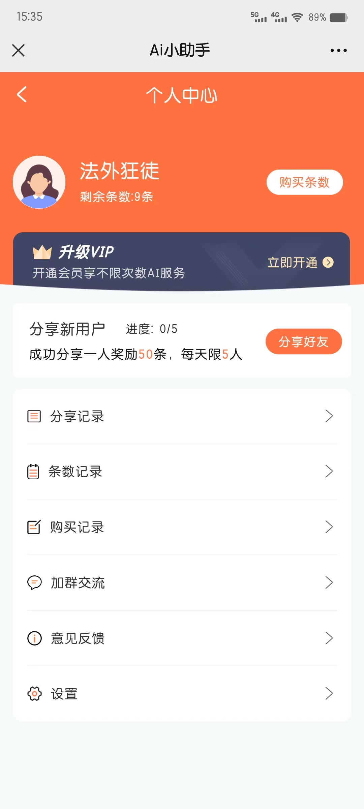
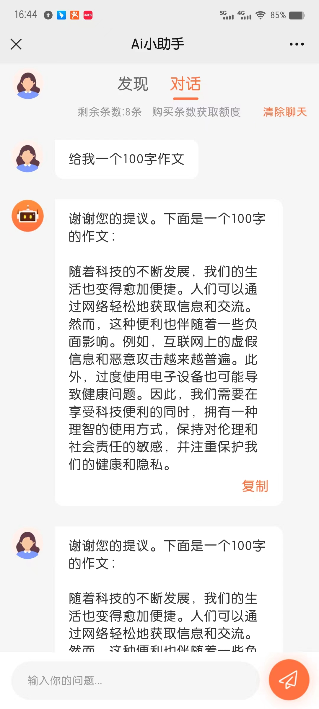
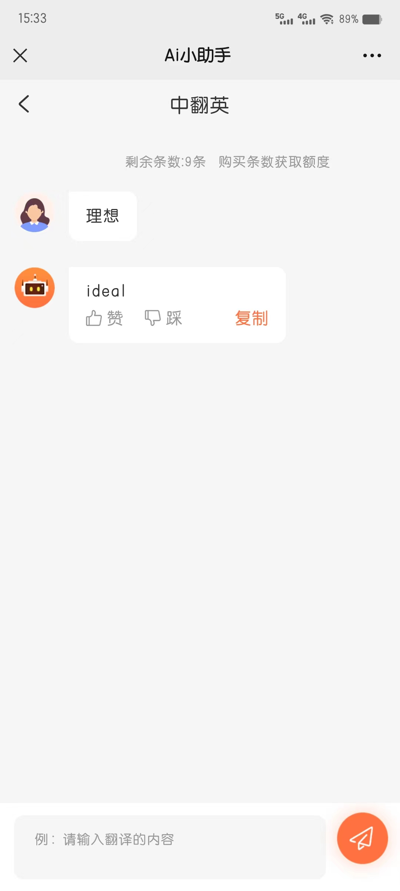

## 项目名称
* AI小助手

## 项目介绍
* 这是一个Ai问答工具，可以充值或者邀请好友获取问答次数，内含丰富问答模板，满足大部分问答需求。

## 运行条件
 
* node.js
* HbuildX或者vscode等

## 目录结构

    ---------------------------------------------------------------------------------------------
    |-- androidPrivacy.json         安卓首次运行隐私协议弹窗配置
    |-- App.vue                     根组件
    |-- core.js                     全局组件和方法
    |-- index.html                  模板文件
    |-- main.js                     入口文件
    |-- manifest.json               应用配置文件（可配置代理）
    |-- package.json                node 包文件
    |-- pages.json                  注册页面
    |-- README.md                   使用文档
    |-- siteinfo.js                 请求接口配置
    |-- uni.scss                    全局主题色、样式
    |-- version.js                  版本号
    |-- api                         接口
    |-- components                  自定义组件
    |-- pages                       页面文件
    |-- static                      静态文件
    |-- store                       vuex
    |-- uni_modules                 uni官方组件模板
    |-- utils                       常用方法、请求等
    ---------------------------------------------------------------------------------------------

## 技术咨询
* AI开源交流群 856295087 (QQ)

## 效果

